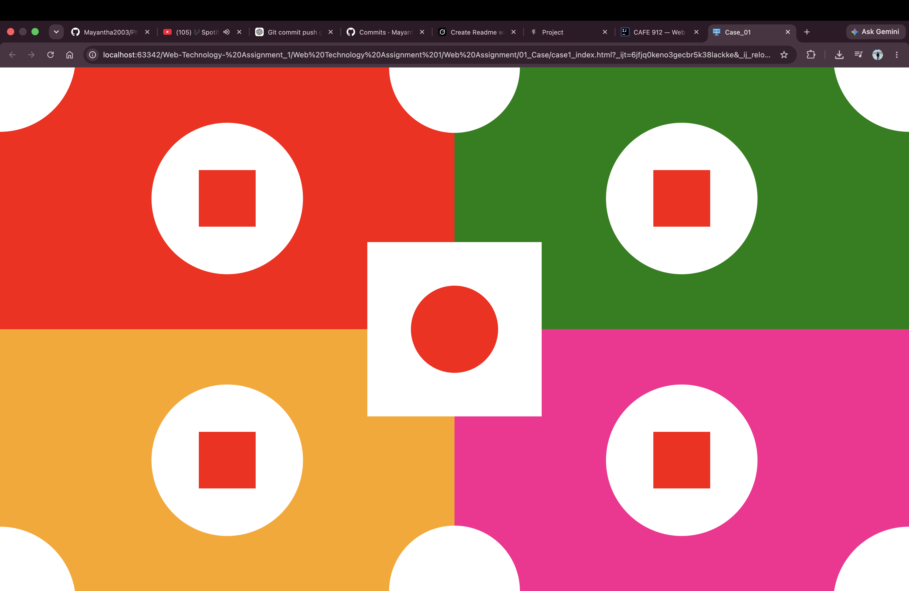
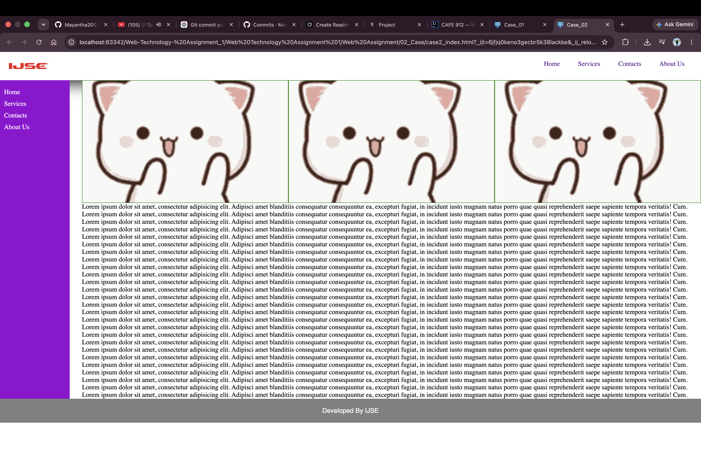
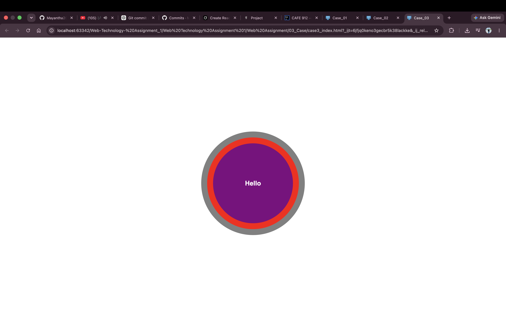
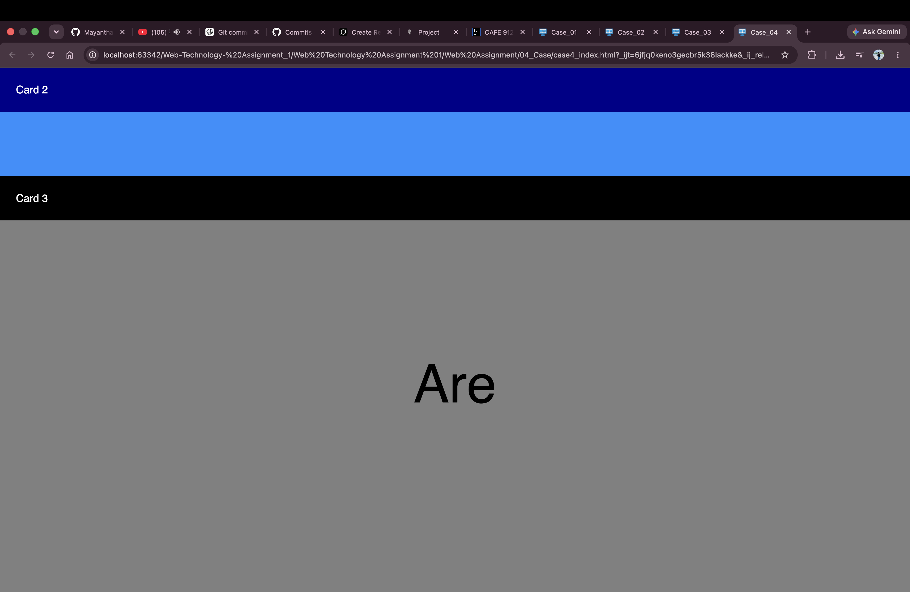
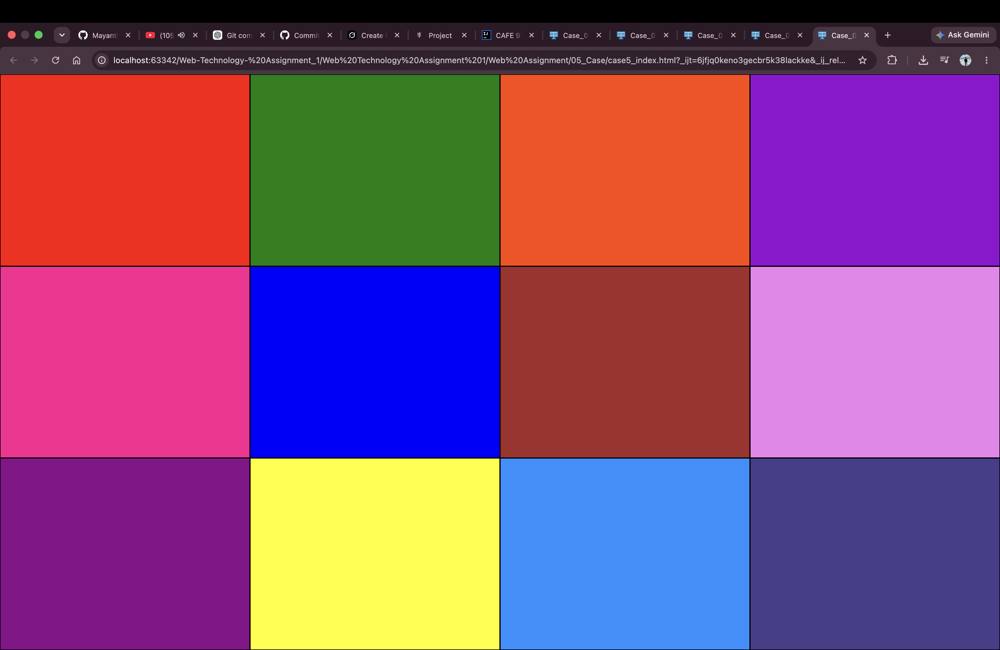
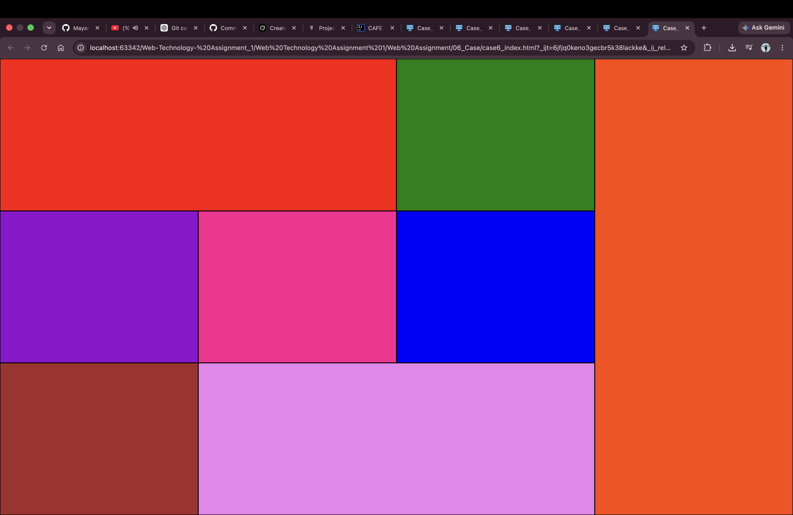

# Web Technology Assignment 1 – CSS Positioning & Layout

IJSE **Web Technology** coursework focused on **CSS positioning** and layout techniques.  
Six design cases implemented with pure **HTML** and **CSS** (no layout frameworks).

**Course module:** Usage of Cascade Style Sheets – 01

---

## Cases Overview

| Case | Description | Key CSS concepts |
|------|-------------|------------------|
| **Case 1** | Full-screen geometric design (4 colored quadrants, circles, squares, center square with red circle) | `position: absolute` / `relative`, fixed layout |
| **Case 2** | Page layout with header nav, purple sidebar, image gallery, lorem content, footer | Multi-section layout, floats / positioning |
| **Case 3** | Centered concentric circles with “Hello” text | Absolute centering, layered circles |
| **Case 4** | Horizontal stacked bands (Card 2 / Card 3 style sections) | Block sections, full-width strips |
| **Case 5** | 3×4 color grid (12 solid color rectangles) | Grid-like layout with boxes |
| **Case 6** | Irregular multi-size colored panel layout | Nested / asymmetric block layout |

---

## Screenshots

### Case 1 – Geometric design (Absolute & Relative)


### Case 2 – Website layout (sidebar + content)


### Case 3 – Centered circles


### Case 4 – Horizontal cards / bands


### Case 5 – Color grid


### Case 6 – Mixed panel layout


---

## Case 1 Requirements (from assignment)

1. Use the **whole screen** for the design  
2. Use **only Absolute and Relative** positions  
3. Apply suitable measurement units  
4. Design must **not change** when the browser is resized  
5. **No images** allowed (shapes built with CSS only)

---

## Tech Stack

| Technology | Usage |
|------------|--------|
| HTML5 | Structure |
| CSS3 | Positioning, colors, layout |
| Normalize.css | Optional base styles (assets) |

---

## Project Structure

```
Web-Technology- Assignment_1/
└── Web Assignment/
    ├── 01_Case/
    │   └── case1_index.html
    ├── 02_Case/
    │   └── case2_index.html
    ├── 03_Case/
    │   └── case3_index.html
    ├── 04_Case/
    │   └── case4_index.html
    ├── 05_Case/
    │   └── case5_index.html
    ├── 06_Case/
    │   └── case6_index.html
    └── assets/
        └── lib/
            └── normalize.css
```

---

## How to Run

Open any case HTML file in a browser:

```bash
# Example
open "Web Assignment/01_Case/case1_index.html"
```

Or use **Live Server** / IntelliJ built-in preview.

---

## Learning Outcomes

- CSS `position: relative` and `position: absolute`
- Building complex UIs without images
- Fixed full-viewport layouts
- Section-based page structure (header, sidebar, content, footer)
- Centering and layering elements

---

## Author

**G. D. Mayantha (Mayantha Sithum Kaveesha)**  
GitHub: [Mayantha2003](https://github.com/Mayantha2003)

**Institute:** IJSE – Institute of Java & Software Engineering  
**Module:** Web Technology – Assignment 1

---

## License

Educational / coursework project.
